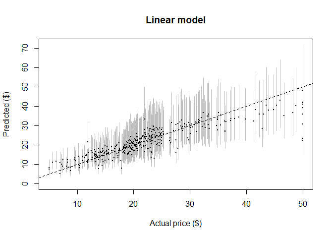

Boston Housing Data
================
Krishna Chaitanya Vamaraju
March 17, 2018

Data description
----------------

The Boston data frame has 506 rows and 14 columns. This data frame contains the following columns:

crim per capita crime rate by town.

zn proportion of residential land zoned for lots over 25,000 sq.ft.

indus proportion of non-retail business acres per town.

chas Charles River dummy variable (= 1 if tract bounds river; 0 otherwise).

nox nitrogen oxides concentration (parts per 10 million).

rm average number of rooms per dwelling.

age proportion of owner-occupied units built prior to 1940.

dis weighted mean of distances to five Boston employment centres.

rad index of accessibility to radial highways.

tax full-value property-tax rate per $10,000.

ptratio pupil-teacher ratio by town.

black 1000(Bk - 0.63)^2 where Bk is the proportion of blacks by town.

lstat lower status of the population (percent).

medv median value of owner-occupied homes in $1000s.

Add required packages
=====================

We’ll fit a linear model for the log price, on the thought that it makes some sense for the factors which raise or lower house values to multiply together, rather than just adding.

    ## 
    ## Call:
    ## lm(formula = log(medv) ~ ., data = boston.train)
    ## 
    ## Residuals:
    ##     Min      1Q  Median      3Q     Max 
    ## -0.6822 -0.1019 -0.0173  0.1093  0.8099 
    ## 
    ## Coefficients:
    ##              Estimate Std. Error t value Pr(>|t|)
    ## (Intercept)  4.09e+00   2.45e-01   16.66  < 2e-16
    ## crim        -1.04e-02   1.38e-03   -7.55  3.6e-13
    ## zn           1.21e-03   6.49e-04    1.86  0.06382
    ## indus        2.38e-03   2.97e-03    0.80  0.42231
    ## chas         8.92e-02   4.25e-02    2.10  0.03672
    ## nox         -8.04e-01   1.82e-01   -4.42  1.3e-05
    ## rm           9.93e-02   2.05e-02    4.84  1.9e-06
    ## age          8.14e-05   6.26e-04    0.13  0.89666
    ## dis         -4.89e-02   9.68e-03   -5.05  6.8e-07
    ## rad          1.60e-02   3.19e-03    5.02  8.1e-07
    ## tax         -6.96e-04   1.82e-04   -3.82  0.00015
    ## ptratio     -3.96e-02   6.36e-03   -6.22  1.3e-09
    ## black        3.76e-04   1.26e-04    2.99  0.00297
    ## lstat       -2.64e-02   2.45e-03  -10.77  < 2e-16
    ## 
    ## Residual standard error: 0.193 on 365 degrees of freedom
    ## Multiple R-squared:  0.786,  Adjusted R-squared:  0.778 
    ## F-statistic:  103 on 13 and 365 DF,  p-value: <2e-16

The R-Square of the Model is 78.6 % when all predictors are included.

A function called `predlims` is created to calculate the confidence intervals for the predicted values of the fit for a 95% CI.Since the regression was performed using the log of response the exponent of the predicted values are plotted against the actual values in the plots.  *Actual median house values (horizontal axis) versus those predicted by the linear model (black dots), plus or minus two predictive standard errors (grey bars). The dashed line shows where actual and predicted prices are equal. And the segments are the standard errors of the predictied points. Predictions are exponentiated so they’re comparable to the original values (and because it’s easier to grasp dollars than log-dollars).*

The in-sample MSE for log(medv) is `r:glm.in.mse`

    ## [1] 0.0359

Percent of predicted values within the constructed CIs is :

    ## [1] 0.945

The +- 2 standard errors do have pretty reasonable coverage; about 96% of actual precise fall within the prediction limits

    ## BIC is  14 -1178.211NULL

    ## AIC is  14 -1233.337NULL

mse for the test data is `r:test.preds.lm`

    ## [1] 0.0337

Residual Plots for the Multiple Linear Regression Model :

The plots indicate a sort of non-linearity between the predictors and target variable. Hence,this is an indication to model the problem with complex models such as Trees or Generalized Addtive Models.

Predicting with `Cross-Validation`

The average cross-validation error for 10-fold cross-validation is :

    ## [1] 0.0379

The cross-validation MSE is 0.0379 for `log(medv)` which is higher than earlier.

Fitting Regression Trees to the Boston Data Set
-----------------------------------------------

    ## Rattle: A free graphical interface for data science with R.
    ## Version 5.1.0 Copyright (c) 2006-2017 Togaware Pty Ltd.
    ## Type 'rattle()' to shake, rattle, and roll your data.

The in-sample MSE is :

    ## [1] 0.0282

The out-of-sample MSE is :

    ## [1] 0.0379

Estimating the Complex-parameter using LOOCV :

    ## 
    ## Regression tree:
    ## rpart(formula = log(medv) ~ ., data = boston.train)
    ## 
    ## Variables actually used in tree construction:
    ## [1] age   black crim  lstat nox   rm   
    ## 
    ## Root node error: 63.51/379 = 0.16757
    ## 
    ## n= 379 
    ## 
    ##          CP nsplit rel error  xerror     xstd
    ## 1  0.475732      0   1.00000 1.00603 0.088298
    ## 2  0.151857      1   0.52427 0.54386 0.044891
    ## 3  0.072816      2   0.37241 0.40023 0.042219
    ## 4  0.031063      3   0.29959 0.37356 0.038322
    ## 5  0.024284      4   0.26853 0.32947 0.035602
    ## 6  0.022448      5   0.24425 0.31662 0.035526
    ## 7  0.018370      6   0.22180 0.31876 0.035564
    ## 8  0.014594      7   0.20343 0.29612 0.033194
    ## 9  0.010596      8   0.18884 0.27966 0.032253
    ## 10 0.010253      9   0.17824 0.29092 0.033810
    ## 11 0.010000     10   0.16799 0.29061 0.033762

The train MSE for the pruned Tree is

    ## [1] 0.0316

The Test MSE for the pruned Tree is :

    ## [1] 0.0386

Cross Validation For Trees :

    ## Warning in nominalTrainWorkflow(x = x, y = y, wts = weights, info =
    ## trainInfo, : There were missing values in resampled performance measures.

    ## CART 
    ## 
    ## 379 samples
    ##  13 predictor
    ## 
    ## No pre-processing
    ## Resampling: Cross-Validated (10 fold) 
    ## Summary of sample sizes: 340, 341, 341, 342, 340, 342, ... 
    ## Resampling results across tuning parameters:
    ## 
    ##   cp           RMSE       Rsquared   MAE      
    ##   0.001064170  0.1981441  0.7725971  0.1424845
    ##   0.001093330  0.1981441  0.7725971  0.1424845
    ##   0.001288007  0.1981018  0.7727894  0.1424239
    ##   0.001489072  0.1988277  0.7716555  0.1421485
    ##   0.001556491  0.1987472  0.7722601  0.1422880
    ##   0.001702231  0.1988354  0.7721411  0.1424701
    ##   0.001737247  0.1988354  0.7721411  0.1424701
    ##   0.001864838  0.1988129  0.7713495  0.1415808
    ##   0.002265437  0.1968046  0.7752173  0.1388240
    ##   0.002515482  0.1981817  0.7721013  0.1400220
    ##   0.003284142  0.1995469  0.7687817  0.1428406
    ##   0.004168973  0.1992356  0.7682523  0.1430559
    ##   0.006747932  0.1977369  0.7693512  0.1399431
    ##   0.008833973  0.1982779  0.7678917  0.1410378
    ##   0.009108303  0.1996557  0.7650747  0.1419816
    ##   0.010252699  0.2023747  0.7613683  0.1449914
    ##   0.010595624  0.2024429  0.7595352  0.1441704
    ##   0.014593789  0.2051457  0.7537756  0.1465037
    ##   0.018369840  0.2067651  0.7498561  0.1495446
    ##   0.022447934  0.2128644  0.7358112  0.1532801
    ##   0.024284445  0.2169279  0.7268224  0.1573690
    ##   0.031062720  0.2346986  0.6809508  0.1697419
    ##   0.072815645  0.2507754  0.6450525  0.1821669
    ##   0.151857024  0.2845593  0.5178411  0.2130672
    ##   0.475732426  0.3595224  0.4276513  0.2747785
    ## 
    ## RMSE was used to select the optimal model using the smallest value.
    ## The final value used for the model was cp = 0.002265437.

    ## n= 379 
    ## 
    ## node), split, n, deviance, yval
    ##       * denotes terminal node
    ## 
    ##  1) root 379 63.5103500 3.027384  
    ##    2) lstat>=14.4 129 14.1446100 2.634324  
    ##      4) crim>=15.718 21  2.4546220 2.204944  
    ##        8) nox>=0.675 14  0.7558999 2.020703 *
    ##        9) nox< 0.675 7  0.2730463 2.573426 *
    ##      5) crim< 15.718 108  7.0654380 2.717815  
    ##       10) nox>=0.607 61  3.8267550 2.612919  
    ##         20) lstat>=19.915 24  1.5767510 2.441205  
    ##           40) black< 346.765 8  0.5335799 2.204398 *
    ##           41) black>=346.765 16  0.3702393 2.559609 *
    ##         21) lstat< 19.915 37  1.0833290 2.724301  
    ##           42) crim>=5.76921 18  0.4584978 2.647162 *
    ##           43) crim< 5.76921 19  0.4162543 2.797380 *
    ##       11) nox< 0.607 47  1.6963690 2.853956  
    ##         22) crim>=0.55381 25  0.8965937 2.764378  
    ##           44) dis>=3.65285 11  0.1075603 2.674194 *
    ##           45) dis< 3.65285 14  0.6292743 2.835237 *
    ##         23) crim< 0.55381 22  0.3712121 2.955749 *
    ##    3) lstat< 14.4 250 19.1518100 3.230203  
    ##      6) rm< 6.676 173  5.1271240 3.099167  
    ##       12) lstat>=9.715 84  1.2559580 3.023825 *
    ##       13) lstat< 9.715 89  2.9443100 3.170277  
    ##         26) age< 84.6 82  1.6584250 3.145285  
    ##           52) rm< 6.1245 24  0.4088933 3.016697 *
    ##           53) rm>=6.1245 58  0.6884826 3.198494 *
    ##         27) age>=84.6 7  0.6347329 3.463032 *
    ##      7) rm>=6.676 77  4.3801920 3.524610  
    ##       14) rm< 7.435 56  1.7640800 3.426591  
    ##         28) lstat>=5.495 26  0.7948576 3.317416  
    ##           56) indus>=9.285 7  0.3054683 3.151160 *
    ##           57) indus< 9.285 19  0.2246164 3.378668 *
    ##         29) lstat< 5.495 30  0.3907508 3.521208 *
    ##       15) rm>=7.435 21  0.6433082 3.785995 *

    ## Percent data in constructed CIs is: 0.9577836

MSE of in-Sample and Out Sample for GAM fit

    ## [1] 0.026

MSE for Out-Of-Sample for GAM fit :

    ## [1] 0.027

*Actual versus predicted prices for the additive model.*

*The estimated partial response functions for the additive model, with a shaded region showing ±2 standard errors. The tick marks along the horizontal axis show the observed values of the input variables (a rug plot); The error bars are wider where there are fewer observations.The vertical scales are logarithmic*

AIC and BIC of the Models :

    ## AIC of GAM Model is  27.519 -251.178

    ## 
    ## BIC of GAM Model is  27.519 79.051

The RMSE for log(medv) obtained through 10-fold cv is :

The summary of the above fit is as below :

    ## 
    ## Family: gaussian 
    ## Link function: identity 
    ## 
    ## Formula:
    ## .outcome ~ chas + rad + s(ptratio) + s(tax) + s(indus) + s(nox) + 
    ##     s(black) + s(age) + s(dis) + s(rm) + s(lstat) + s(crim)
    ## 
    ## Parametric coefficients:
    ##             Estimate Std. Error t value Pr(>|t|)    
    ## (Intercept)  2.80930    0.05806   48.38  < 2e-16 ***
    ## chas         0.05441    0.03289    1.65  0.09906 .  
    ## rad          0.02218    0.00595    3.73  0.00023 ***
    ## ---
    ## Signif. codes:  0 '***' 0.001 '**' 0.01 '*' 0.05 '.' 0.1 ' ' 1
    ## 
    ## Approximate significance of smooth terms:
    ##             edf Ref.df     F p-value    
    ## s(ptratio) 1.00   1.00 22.83 2.6e-06 ***
    ## s(tax)     3.14   3.81  8.28 3.6e-06 ***
    ## s(indus)   8.07   8.71  2.85  0.0033 ** 
    ## s(nox)     8.92   8.99 16.20 < 2e-16 ***
    ## s(black)   1.98   2.46  1.99  0.1148    
    ## s(age)     1.00   1.00  0.90  0.3440    
    ## s(dis)     8.67   8.96  5.12 1.6e-06 ***
    ## s(rm)      4.88   6.02 11.64 5.6e-12 ***
    ## s(lstat)   4.77   5.90 26.43 < 2e-16 ***
    ## s(crim)    2.60   3.26 25.57 5.4e-16 ***
    ## ---
    ## Signif. codes:  0 '***' 0.001 '**' 0.01 '*' 0.05 '.' 0.1 ' ' 1
    ## 
    ## R-sq.(adj) =  0.882   Deviance explained = 89.7%
    ## GCV = 0.022737  Scale est. = 0.019855  n = 379

The difference between the testing and training errors of the GAM and GLM model indicate that the bias of the model is reduced when non-linearity with X's and `medv` is assumed .

Neural Networks
---------------

The Neural Network is built using the `caret` package in R.

    ## Model Averaged Neural Network with 5 Repeats  
    ## 
    ## a 13-5-1 network with 76 weights
    ## options were - linear output units  decay=0.01

Train and Test MSE for Neural Networks

    ## [1] 0.0103

    ## [1] 0.0246

    ## MSE of Neural Network Model is  0.01

    ## 
    ## MSE of Neural Network Model is  0.025

Analyzing all the Four Models
-----------------------------

The plot above indicates that Neural networks perform the best for both the train and test errors.Hence, we go ahead with the Neural networks to build the Model
